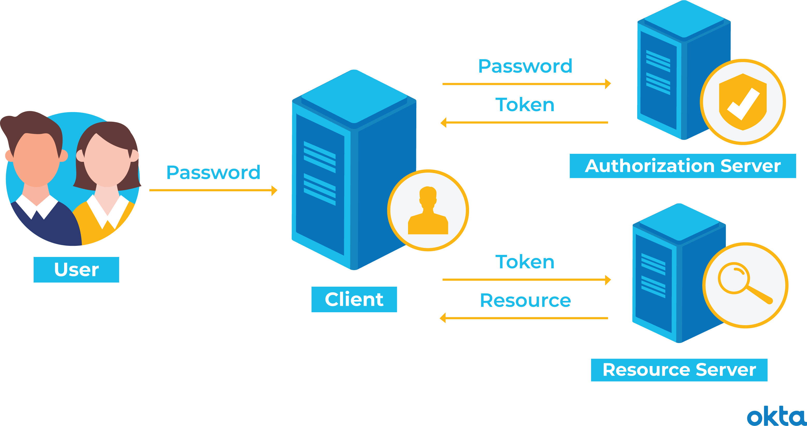
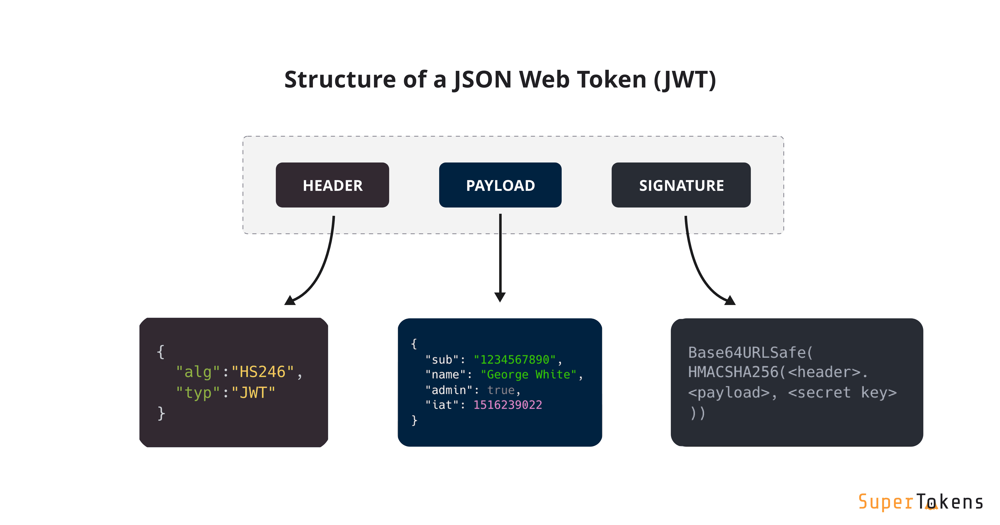

# Authentifizierung bei Web-APIs

## Inhaltsverzeichnis

- [Authentifizierung bei Web-APIs](#authentifizierung-bei-web-apis)
  - [Inhaltsverzeichnis](#inhaltsverzeichnis)
  - [Einleitung](#einleitung)
    - [Voraussetzungen für die Authentifizierung](#voraussetzungen-für-die-authentifizierung)
    - [Token-basierte Authentifizierung](#token-basierte-authentifizierung)
    - [JSON Web Token (JWT)](#json-web-token-jwt)
    - [Bearer-Token-Authentifizierung](#bearer-token-authentifizierung)
    - [Vor- und Nachteile von Token-basierter Authentifizierung](#vor--und-nachteile-von-token-basierter-authentifizierung)
      - [Vorteile](#vorteile)
      - [Nachteile](#nachteile)
    - [Fazit](#fazit)
  - [Quellen](#quellen)

## Einleitung

- Grundkonzept: Authentifizierung bei Web-APIs sichert den Zugang und schützt vor unbefugtem Zugriff.
- Bedeutung: Zentral für die Sicherheit und Integrität von Webanwendungen.
- Fokus: Untersuchung verschiedener Authentifizierungsstrategien wie token-basierte Authentifizierung, JWT und Bearer-Token.
- Ziel: Verständnis für Funktionsweise, Vorzüge und Herausforderungen dieser Methoden.

### Voraussetzungen für die Authentifizierung

- **Sichere Server-Umgebung**: Ein sicherer und zuverlässiger Server, auf dem die API läuft.
- **SSL/TLS-Verschlüsselung**: Um Datenübertragungen zu verschlüsseln und die Kommunikation zu sichern.
- **API-Schlüssel**: Einzigartige Identifikatoren für Anwender oder Anwendungen, die auf die API zugreifen.
- **Benutzerverwaltung**: System zur Verwaltung von Benutzeridentitäten und Zugriffsrechten.
- **Rate Limiting**: Mechanismen zur Begrenzung der Anzahl der Anfragen, um Missbrauch zu verhindern.
- **Protokollierung und Überwachung**: Aufzeichnung von API-Zugriffen zur Analyse und Erkennung ungewöhnlicher Aktivitäten.
- **Aktualisierte Software**: Gewährleistung, dass alle Systemkomponenten auf dem neuesten Stand sind, um bekannte Sicherheitslücken zu schliessen.

### Token-basierte Authentifizierung

- **Definition**: Verwendung eines generierten Tokens als Authentifizierungsnachweis.
- **Erzeugung**: Der Token wird nach erfolgreicher Anmeldung durch Benutzername und Passwort generiert.
- **Eigenschaften**: Tokens sind zeitlich begrenzt gültig und enthalten oft Berechtigungsinformationen.
- **Sicherheit**: Tokens werden über sichere Kanäle übertragen, oft mit SSL/TLS-Verschlüsselung.
- **Verwendung**: Der Client sendet den Token bei jeder Anfrage, um sich zu authentifizieren.
- **Vorteile**: Reduziertes Risiko der Offenlegung von Benutzerdaten und verbesserte Zugriffskontrolle.
- **Speicherung**: Serverseitige Speicherung des Tokens ist nicht erforderlich, da dieser bei jeder Anfrage mitgesendet wird.
- **Typische Einsatzgebiete**: REST-APIs, Single-Page-Anwendungen und mobile Apps.

### JSON Web Token (JWT)

Zum Testen der [Encode](https://jwt.io/) und [Decode](https://www.jstoolset.com/jwt) auf diesen folgenden Webseiten.

- **Grundkonzept**: Ein kompaktes und selbstständiges Mittel für sicher übertragene Informationen zwischen Parteien.
- **Struktur**: Besteht aus drei Teilen – Header, Payload und Signature.
  - _Header_: Enthält Informationen über den Typ des Tokens (JWT) und das verwendete Verschlüsselungsverfahren.
  - _Payload_: Beinhaltet die zu übertragenden Daten (Claims), wie Benutzerinformationen und Berechtigungen.
  - _Signature_: Wird erstellt, indem Header und Payload kodiert und mit einem geheimen Schlüssel signiert werden.
- **Kodierung**: Der Inhalt wird in Base64URL kodiert, um die Übertragung zu vereinfachen.
- **Sicherheit**: Die Signatur gewährleistet die Integrität und Authentizität des Tokens.
- **Anwendungsbeispiele**:
  - _Authentifizierung_: JWT wird nach dem Einloggen erstellt und bei jeder Anfrage an den Server gesendet.
  - _Information Exchange_: JWT kann sicher und zuverlässig Informationen zwischen verschiedenen Systemen übertragen.
- **Vorteile**: Hohe Sicherheit, einfache Implementierung, geeignet für verteilte Systeme.
- **Nachteile**: Speicherung umfangreicher JWTs kann problematisch sein, Risiko bei gestohlenen Tokens.

### Bearer-Token-Authentifizierung

- **Definition**: Eine Authentifizierungsmethode, bei der der Zugang zu einer Ressource durch den Besitz eines Tokens gewährt wird.
- **Token-Natur**: Der "Bearer" des Tokens hat Zugriffsrechte, unabhängig von der Identität des Besitzers.
- **Erhalt des Tokens**: Der Benutzer erhält das Token nach einer erfolgreichen Authentifizierung, meist über OAuth-Flows.
- **Übertragung**: Das Token wird als Teil des HTTP-Authorization-Headers in jeder Anfrage gesendet.
- **Sicherheitsrisiken**: Da der Besitz des Tokens allein den Zugriff gewährt, ist die sichere Speicherung und Übertragung entscheidend.
- **Einsatzgebiete**: Häufig in REST-APIs und mobilen Anwendungen, wo einfache Zugriffskontrolle benötigt wird.
- **Vorteile**: Einfache Implementierung, weit verbreitet und unterstützt durch viele Frameworks.
- **Nachteile**: Erhöhtes Sicherheitsrisiko bei Diebstahl oder Leck des Tokens, da keine weiteren Identitätsprüfungen erfolgen.

### Vor- und Nachteile von Token-basierter Authentifizierung

#### Vorteile

- **Verbesserte Sicherheit**: Tokens bieten eine sicherere Authentifizierung als traditionelle Benutzername/Passwort-Methoden.
- **Flexibilität**: Tokens können über verschiedene Domänen hinweg verwendet werden, was die Integration in diverse Systeme erleichtert.
- **Selbstenthaltende Informationen**: Tokens enthalten alle nötigen Informationen, was die Serverbelastung reduziert.
- **Ablaufmechanismus**: Tokens haben eine begrenzte Gültigkeitsdauer, was das Risiko bei Diebstahl verringert.

#### Nachteile

- **Token-Speicherung**: Die sichere Speicherung der Tokens auf Clientseite kann eine Herausforderung sein.
- **Token-Diebstahl**: Ein gestohlener Token kann missbraucht werden, bis er abläuft.
- **Performance-Überlegungen**: Die Notwendigkeit, den Token bei jeder Anfrage zu überprüfen, kann die Leistung beeinträchtigen.
- **Komplexität**: Die Implementierung und Verwaltung eines token-basierten Systems kann komplexer sein als einfache Authentifizierungsmechanismen.
- **Token-Erneuerung**: Die Handhabung der Token-Erneuerung erfordert zusätzlichen Aufwand und Überlegungen zur Sicherheit.

### Fazit

- **Wesentliche Erkenntnisse**:
  - Token-basierte Authentifizierungssysteme bieten eine robuste Sicherheit und Flexibilität, sind jedoch mit Herausforderungen wie Token-Management und Sicherheitsrisiken verbunden.
  - JWTs sind besonders nützlich für verteilte Systeme und bieten einen selbstenthaltenden Ansatz zur Übermittlung von Authentifizierungs- und Autorisierungsinformationen.
  - Bearer-Token sind einfach zu implementieren, bergen jedoch Risiken, wenn der Token in falsche Hände gerät.

## Quellen

[JWT-Token](https://jwt.io/)  
[Bearer-Token-Authentifizierung](https://www.predic8.de/bearer-token-autorisierung-api-security.htm)

[Bild 1 - Tokenbasierte ](https://www.okta.com/de/identity-101/what-is-token-based-authentication/)  
[Bild 2 - JWT Token](https://supertokens.com/blog/what-is-jwt)
